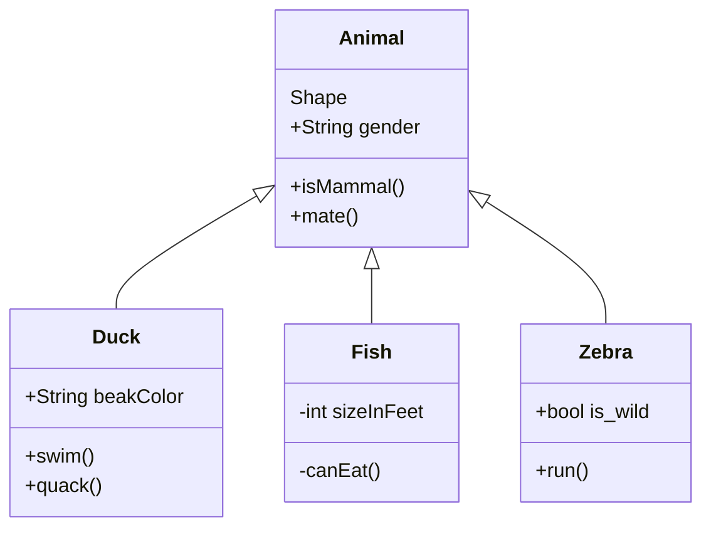

<SwmPath>[pom.xml](/pom.xml)</SwmPath>

<SwmSnippet path="/src/main/java/lt/test/webtest/WebtestApplication.java" line="13" collapsed>

---

This code snippet creates instances of the `Shape` and `Square` classes, sets their properties, and calls the `getArea()` method to calculate their areas. It also creates another instance of `Shape` and sets its name. <SwmToken path="/src/main/java/lt/test/webtest/WebtestApplication.java" pos="13:5:7" line-data="	public void test(){">`test()`</SwmToken>

```java
	public void test(){
		Shape shape = new Shape("shape", "red");
		shape.getArea();
		Square square = new Square("square", "blue", 5);
		square.getArea();
		Shape shape1 = new Shape();
		shape1.setName("shape1");
	}
```

---

</SwmSnippet>

<SwmMeta version="3.0.0" repo-id="Z2l0aHViJTNBJTNBc3dpbW1UZXN0JTNBJTNBU2FydW5hc01lZGVpa2lz" repo-name="swimmTest"><sup>Powered by [Swimm](https://app.swimm.io/)</sup></SwmMeta>
