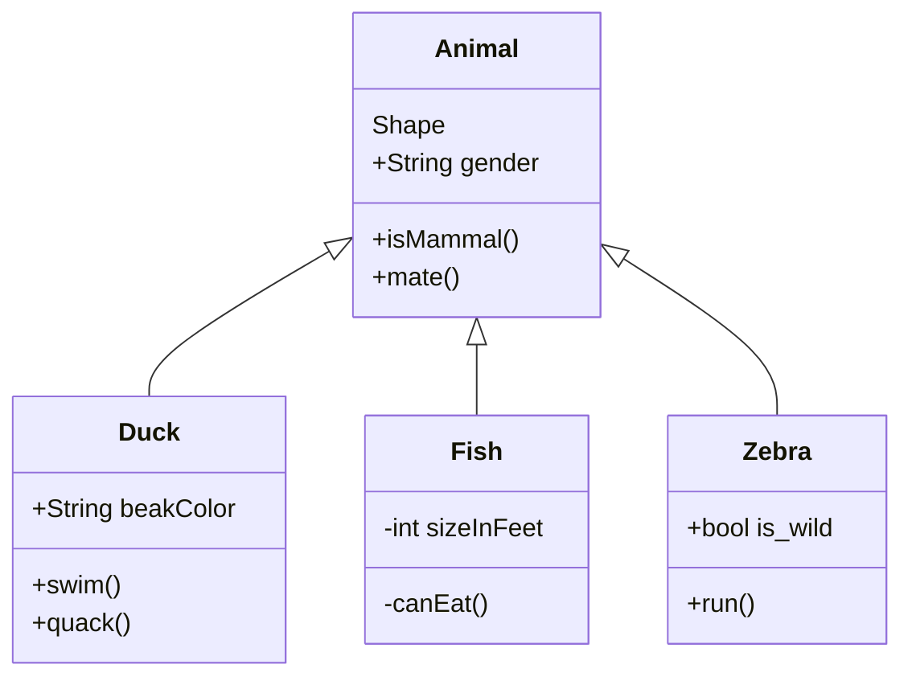

<SwmPath>[pom.xml](/pom.xml)</SwmPath>

<SwmMeta version="3.0.0" repo-id="Z2l0aHViJTNBJTNBc3dpbW1UZXN0JTNBJTNBU2FydW5hc01lZGVpa2lz" repo-name="swimmTest">Powered by [Swimm](https://app.swimm.io/)</SwmMeta>
